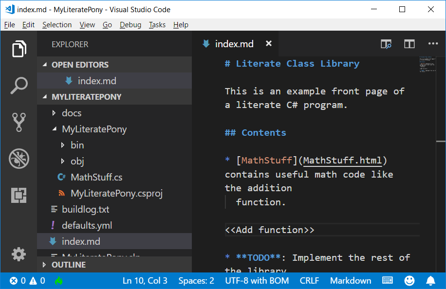
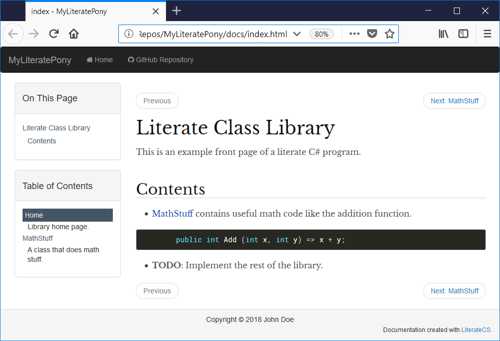



# Literate Programming in C# and .NET Core

LiterateCS is a [Literate Programming] tool that produces clear, 
professional-looking documentation automatically from your C# projects. 
It parses your C# code files and extracts [markdown] documentation from
comments. Alternatively you can write your documentation in separate 
markdown files and interleave pieces of code in them by referring to 
C# regions. LiterateCS can then create either a simple markdown output 
that you can upload to your project's [wiki] pages, or it can generate a 
full-blown static web site that you can host in [GitHub Pages].

The idea of literate programming differs from the usual way of thinking
about technical documentation. Instead of documentation being an afterthough
which is taken care of after the project is done, literate programming encourages 
you to document your code while you are writing it. Also, you don't write your
documentation as an API reference like with [xmldoc comments], but rather 
like text of an essay, explaining the things that need explaining and skipping
the obvious parts.

To get an idea about how this works in practice, refer to the literate 
documentation created from this project. It can be found at:

**<https://johtela.github.io/LiterateCS/>**

Other examples of documentation created with LiterateCS can be found at: 
* <https://johtela.github.io/ExtensionCord/>
* <https://johtela.github.io/LinqCheck/>

## Quickstart

To create your first literate program install first the `literatecs` tool
with command line:

    > dotnet tool install -g literatecs

Then install the project template.

    > dotnet new -i LiterateCS.Templates.LiterateLib.CSharp

After that create a new directory and the project skeleton.

    > mkdir MyLiteratePony
    > cd MyLiteratePony
    > dotnet new literatelib

You should now have files for your class library created. You can
build the project with.

    > dotnet build

To check what you got, you can open your project in [Visual Studio Code]
(this step is optional).

    > code .

You should see the following project structure.

Finally you can create the documentation from your project with:

    > literatecs

To see the generated documentation open the `docs/index.html` page in a web browser.

## Download and Installation

The project was initially written for .NET Framework, but I recently
modified it to target [.NET Core 2.1]. It is available in <https://nuget.org>
as an [.NET Core global tool].

See the [installation instructions] for more details. Documentation of the
command line options and usage examples can be found [here][options].

## Bug Reports & Feedback

If you find a bug or want to suggest a feature, you can submit an [issue].

If you want to contribute to the development, let me know. All help is appreciated.

[Literate Programming]: https://en.wikipedia.org/wiki/Literate_programming
[markdown]: https://en.wikipedia.org/wiki/Markdown
[wiki]: https://help.github.com/articles/about-github-wikis/
[xmldoc comments]: https://docs.microsoft.com/en-us/dotnet/csharp/programming-guide/xmldoc/xml-documentation-comments
[GitHub Pages]: https://pages.github.com/
[Visual Studio Code]: https://code.visualstudio.com/
[.NET Core 2.1]: https://www.microsoft.com/net/download/dotnet-core/2.1#sdk-2.1.300
[.NET Core global tool]: https://docs.microsoft.com/en-us/dotnet/core/tools/global-tools
[installation instructions]: https://johtela.github.io/LiterateCS/Installation.html
[options]: https://johtela.github.io/LiterateCS/LiterateCS/Options.html
[issue]: https://github.com/johtela/LiterateCS/issues